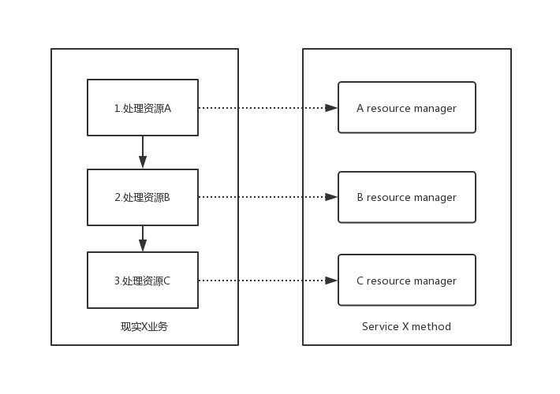
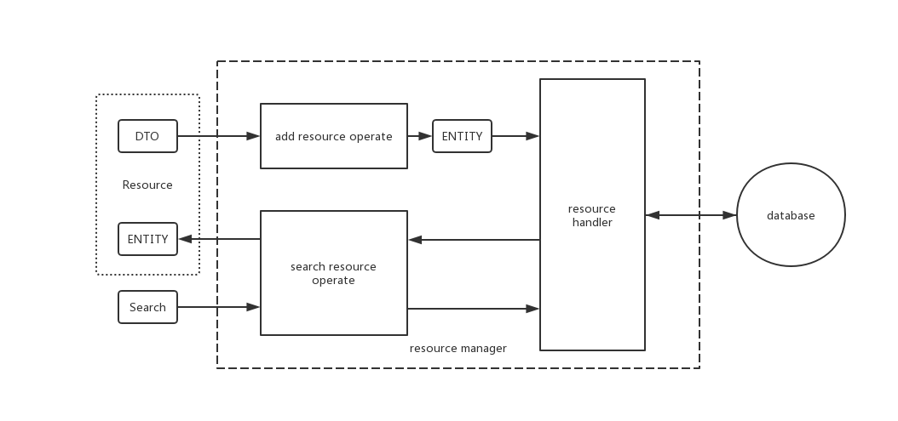
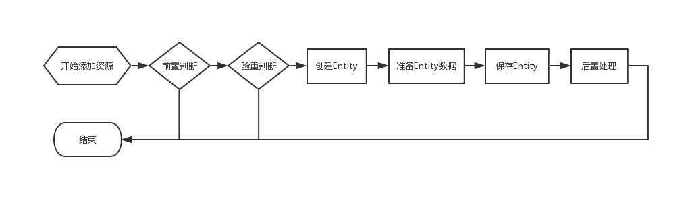

## Resource Manager

规范数据库资源的操作

### 资源管理器

讨论资源管理器之前先明确一下现有应用分层体系每一层的职责（基于spring-boot）：

- **@Repository / @Mapper**：它们本质上都属于**DAO （数据访问对象 Data Access Object）**，所谓DAO就是直接与数据库交互的对象，通常它不涉及到对业务的逻辑处理，只是单纯的操纵数据库。spring-data-jpa的自定义实现的RepositoryImpl也只是对操纵数据库的扩展；mybatis就更不用说了，仅仅只是调用了某句SQL
- **@Service**： 这层就是应用真正存在的意义，解决业务逻辑。通常它会调用各种DAO来解决业务逻辑
- **@Controller**： 控制层，可以认为是请求进来的第一步（实际上前面还有一层拦截器）。通常它用于分发调用Service层的逻辑方法，可以调用多个Service解决多个业务逻辑。该层也可以对Service的处理结果进一步处理，处理成希望响应的格式

##### 那么资源管理器是什么？

实际上资源管理器处在DAO层和Service层之间，其实算半层的Service，用于简化Service层的逻辑处理。

假如说一个Service的业务逻辑涉及处理多资源业务。那么Manager就是单资源业务的处理器，把各个资源的操作划分出界限独立处理，使代码逻辑更加清晰。对资源的操作划分出若干个步骤，按生命周期来处理，方便有针对性的扩展。



### 名词定义

+ **资源（Resource）**：一个现实事物称为资源，通常对应于数据库的一个表

+ **实体（Entity）**: 资源对应的Java Bean称为实体，按照数据库不同可分为**关系型数据库实体（Persistence Object 简称 PO）**和**文档型数据库实体（Document 简称 DOC）**

+ **数据传输对象（DTO）**： 资源操作的入参

+ **资源操作（Resource Operate）**： 对资源的增删改查都称为资源操作，一个操作流程即是一个生命周期

+ **管理器（Resource Manager）**: 集合资源所有操作的管理者，其实相当于通常的一层Service，但它仅仅是对单一资源的管理

+ **资源操作实现者（Resource Handler）**: 真正实现资源操作的实现者

+ **查询条件（Search）**： 封装普通列表查询的条件

它们的关系如图：



### 资源的管理流程

一般的资源管理流程差不多都是相同的逻辑，可概述为下图：



从图上可以看出来资源管理的通用步骤：

+ **前置判断（before）**: 用于判断该资源是不是需要添加，适合配置有限制条件的资源
+ **验重判断（check）**: 用于对不可重复资源的验重，比如像客户资源手机号码不可重复
+ **创建/合并Entity（create/merge）**： 将资源存储进数据库的第一步肯定是先要创建实体并把入参赋值进实体，或者修改资源时需要将入参合并到现有实体中
+ **准备Entity数据（prepare）**: 将添加资源的入参填入Entity
+ **保存/删除Entity（save/remove）**: 将资源数据持久化进数据库
+ **后置处理（after）**： 在资源添加完成后触发其它相关操作，比如在添加完客户资源后，要进行一系列的客户相关数据初始化工作或者发送邮件

### 使用Resource Manager

目前resource-manager框架有两套实现，分别基于spring-data-jpa和spring-data-mongodb

```xml
<dependency>
    <groupId>com.github.developframework</groupId>
    <artifactId>resource-manager-jpa</artifactId>
    <version>${resource-manager.version}</version>
</dependency>
<dependency>
    <groupId>com.github.developframework</groupId>
    <artifactId>resource-manager-mongodb</artifactId>
    <version>${resource-manager.version}</version>
</dependency>
```

#### ResourceManager的可用方法

ResourceManager接口涵盖了业务开发时经常需要使用的基础方法：

| 方法                                      | 说明                                                         |
| ----------------------------------------- | ------------------------------------------------------------ |
| boolean existsById(ID id)                 | 根据ID查询资源是否存在                                       |
| void assertExistsById(ID id)              | 根据ID断言资源存在，如果不存在则会报ResourceNotExistException |
| Optional<ENTITY> findOneById(ID id)       | 单查询                                                       |
| ENTITY findOneByIdRequired(ID id)         | 单查询 不存在则抛出ResourceNotExistException                 |
| Optional<ENTITY> add(Object dto)          | 调用Add操作添加资源                                          |
| boolean modifyById(ID id, Object dto)     | 根据ID调用Modify操作修改资源                                 |
| boolean modify(Object dto, ENTITY entity) | 调用Modify操作修改资源                                       |
| Optional<ENTITY> removeById(ID id)        | 根据ID调用Remove操作删除资源                                 |
| boolean remove(ENTITY entity)             | 调用Remove操作删除资源                                       |
| List<ENTITY> listForIds(ID[] ids)         | 根据ID数组查询资源列表                                       |

如果是基于spring-data系列的持久层框架的话，还有额外的查询列表和分页方法

| 方法                                                 | 说明                               |
| ---------------------------------------------------- | ---------------------------------- |
| List<ENTITY> list(SEARCH search)                     | 根据Search条件查询列表             |
| List<ENTITY> list(Sort sort, SEARCH search)          | 根据Search条件查询列表并按Sort排序 |
| Page<ENTITY> pager(Pageable pageable, SEARCH search) | 根据Pageable和Search条件分页查询   |

#### resource-manager-jpa分支

```java
@Service
public class UserManager extends JpaResourceManager<UserPO, Integer, UserJpaRepository> {

    public UserManager(UserJpaRepository repository) {
        super(repository, UserPO.class, "user");
    }

}
```

继承JpaResourceManager，实现方法需要给父类提供两个参数，实体类型和资源的名称

其中内置注入EntityManager，可以方便随时编写复杂查询

#### resource-manager-mongodb分支

```java
@Service
public class MemberManager extends MongoResourceManager<MemberDOC, String, MemberMongoRepository> {

    public MemberManager(MemberMongoRepository repository) {
        super(repository, MemberDOC.class, "member");
    }

}
```

mongodb的manager也差不多，继承自MongoResourceManager

其中内置注入MongoOperations，可以方便随时编写复杂查询

#### resource operate

resource manager内置以下操作流程扩展：

+ **AddResourceOperate** 添加资源操作
+ **AddUniqueResourceOperate** 添加唯一资源操作
+ **ModifyResourceOperate** 修改资源操作
+ **ModifyUniqueResourceOperate** 修改唯一资源操作
+ **RemoveResourceOperate** 删除资源操作
+ **SearchResourceOperate** 查询资源操作

Add操作的扩展步骤：

+ **boolean before(ENTITY dto)** 前置判断，为true时继续下面的流程
+ **ENTITY create(DTO dto)** 创建
+ **void prepare(DTO dto, ENTITY entity)** 准备
+ **void after(DTO dto, ENTITY entity)** 后置处理

AddUnique操作的扩展步骤在Add的基础上多了一个：

+ **AddCheckExistsLogic<ENTITY, DTO, ID> configureCheckExistsLogic()** 配置检查存在逻辑，需要实现AddCheckExistsLogic接口描述如何判定资源已存在

Modify操作的扩展步骤：

- **boolean before(DTO dto, ENTITY entity)** 前置判断，为true时继续下面的流程
- **void merge(DTO dto, ENTITY entity)** 合并
- **void prepare(DTO dto, ENTITY entity)** 准备
- **void after(DTO dto, ENTITY entity)** 后置处理

ModifyUnique操作的扩展步骤在Modify的基础上多了一个：

- **ModifyCheckExistsLogic<ENTITY, DTO, ID> configureCheckExistsLogic()** 配置检查存在逻辑，需要实现ModifyCheckExistsLogic接口描述如何判定资源已存在

Remove操作的扩展步骤：

+ **boolean before(ENTITY entity)** 前置判断，为true时继续下面的流程
+ **void after(ENTITY entity)** 后置处理

Search操作的扩展步骤：

- **void after(ENTITY entity)** 后置处理

一份完整的Manager代码：

```java
@Service
public class UserManager extends JpaResourceManager<UserPO, Integer, UserJpaRepository> {

    public UserManager(UserJpaRepository repository) {
        super(repository, UserPO.class, "user");
    }

    private AddUniqueResourceOperate<UserPO, UserDTO, Integer> addResourceOperate() {
        return new AddUniqueResourceOperate<>(UserDTO.class, UserMapper.class) {

            @Override
            protected boolean before(UserDTO dto) {
                // 这里用于判断是否可以执行添加
                return true;
            }

            // 如果是唯一资源将需要实现该方法
            @Override
            public AddCheckExistsLogic<UserPO, UserDTO, Integer> configureCheckExistsLogic() {
                // 根据name验重
                return dto -> repository.existsByName(dto.getName());
            }

            // 此方法可以省略，内部就是这么执行的，如果没有定义mapper则会new一个ENTITY对象
            @Override
            protected UserPO create(UserDTO dto) {
                // 将DTO的数据赋值到ENTITY
                return mapper.toENTITY(dto);
            }

            @Override
            protected void prepare(UserDTO dto, UserPO entity) {
                // 到这里entity其实已经有了来自DTO的值，这一步主要处理其它准备数据的逻辑
            }

            @Override
            protected void after(UserDTO dto, UserPO entity) {
                // 持久化ENTITY完成后，后续的业务逻辑
            }
        };
    }

    private ModifyUniqueResourceOperate<UserPO, UserDTO, Integer> modifyResourceOperate() {
        return new ModifyUniqueResourceOperate<>(UserDTO.class, UserMapper.class) {

            @Override
            protected boolean before(UserDTO dto, UserPO entity) {
                // 这里用于判断是否可以执行修改
                return true;
            }

            @Override
            public ModifyCheckExistsLogic<UserPO, UserDTO, Integer> configureCheckExistsLogic() {
                // 修改时需要判断当name值是一个新值时才需要去验重
                return (dto, entity) -> !entity.getName().equals(dto.getName()) && repository.existsByName(dto.getName());
            }

            // 此方法可以省略，内部就是这么执行的，如果没有定义mapper则不会合并数据
            @Override
            protected void merge(UserDTO dto, UserPO entity) {
                // 将DTO的数据合并到原ENTITY对象上
                mapper.toENTITY(dto, entity);
            }

            @Override
            protected void prepare(UserDTO dto, UserPO entity) {
                // 准备其它数据
            }

            @Override
            protected void after(UserDTO dto, UserPO entity) {
                // 持久化ENTITY完成后，后续的业务逻辑
            }
        };
    }

    private RemoveResourceOperate<UserPO, Integer> removeResourceOperate() {
        return new RemoveResourceOperate<>() {

            @Override
            protected boolean before(UserPO entity) {
                // 这里用于判断是否可以执行删除
                return true;
            }

            @Override
            protected void after(UserPO entity) {
                // 删除ENTITY后，后续的业务逻辑
            }
        };
    }

    private SearchResourceOperate<UserPO, Integer> searchResourceOperate() {
        return new SearchResourceOperate<>() {

            @Override
            public void after(UserPO entity) {
                // 查询ENTITY后，后续的业务逻辑，通常用于批量执行ENTITY内的某个方法
            }
        };
    }
}
```

以上扩展方法都不是必须实现的，按照具体的业务逻辑来实现。

Add和Modify的操作可以根据不同的DTO定义多个不同的操作实现

##### resource operate的注册

资源操作的注册也是非常简单，只需要在Manager类里申明方法就可以自动注册了，该方法的特征是：

+ 必须是无参的方法
+ 返回值为ResourceOperate子类，所有的资源操作都继承与ResourceOperate
+ 权限修饰符随意，一般为了不在外部使用申明为private，在方法上标注@SuppressWarnings("unused")关闭编辑器的警告

在应用启动时将会输出注册日志

```
[ 2019-09-27 16:44:12.883 INFO ] - c.g.d.r.ResourceOperateRegistry - register UserDTO for UserPO add operate
[ 2019-09-27 16:44:12.883 INFO ] - c.g.d.r.ResourceOperateRegistry - register UserPO search operate
[ 2019-09-27 16:44:12.884 INFO ] - c.g.d.r.ResourceOperateRegistry - register UserDTO for UserPO modify operate
[ 2019-09-27 16:44:12.884 INFO ] - c.g.d.r.ResourceOperateRegistry - register UserPO remove operate
```

Add和Modify的操作可以根据不同的DTO注册多个不同的操作实现

```java
private AddResourceOperate<UserPO, UserDTOForAdd1, Integer> addResourceOperate1() {
    return new AddResourceOperate<>(UserDTOForAdd1.class, UserDTOForAdd1Mapper.class) {

    };
}

private AddResourceOperate<UserPO, UserDTOForAdd2, Integer> addResourceOperate2() {
    return new AddResourceOperate<>(UserDTOForAdd2.class, UserDTOForAdd2Mapper.class) {

    };
}
```

当Manager没有注册对应DTO的操作方法时将会报错

```
com.github.developframework.resource.exception.UnRegisterOperateException: Manager "xxx.UserManager" is not register add resource operate for DTO "xxx.UserDTO"
```

使用`@DefaultRegister`注解可以帮你自动注册不需要自定义的操作实现

```java
@Service
@DefaultRegister(dtoClass = UserDTO.class, mapperClass = UserMapper.class)
public class UserManager extends JpaResourceManager<UserPO, Integer, UserJpaRepository> {

    public UserManager(UserJpaRepository repository) {
        super(repository, UserPO.class, "user");
    }
}
```

`@DefaultRegister`注解会根据所填DTO和Mapper自动注册对应的Add、Modify、Remove操作，不会覆盖自定义实现的操作

#### 资源查询

使用统一接口`Search<ENTITY>` 描述查询方法

Search接口根据数据库分出两个子类`JpaSearch<PO>`和`MongoSearch<DOC>`

```java
public class UserSearch implements JpaSearch<UserPO> {
    
    private String name;
    
    private Integer age;
    
    @Override
    public Specification<UserPO> toSpecification() {
        return (root, criteriaQuery, criteriaBuilder) -> {
            List<Predicate> predicates = new LinkedList<>();
            if(StringUtils.isNotEmpty(name)) {
                predicates.add(
                        criteriaBuilder.like(root.get("name"), name + "%")
                );
            }
            if(age != null) {
                predicates.add(
                        criteriaBuilder.equal(root.get("age"), age)
                );
            }
            criteriaQuery.where(predicates.toArray(Predicate[]::new));
            return null;
        };
    }
}
```

JpaSearch需要实现如何得到Specification对象

```java
public class MemberSearch implements MongoSearch<MemberDOC> {

    private String name;

    private Integer age;

    @Override
    public Query toQuery() {
        Criteria criteria = new Criteria();
        if(StringUtils.isNotEmpty(name)) {
            criteria.and("name").regex("^" + name);
        }
        if(age != null) {
            criteria.and("age").is(age);
        }
        return Query.query(criteria);
    }
}
```

MongoSearch需要实现如何得到Query对象

Search可以作为springmvc的controller参数，自动从请求中装填参数值

```java
@TemplateId("user-pager")
@GetMapping
public KiteResponse findUserPager(Pageable pageable, UserSearch search) {
    Page<UserPO> page = resourceManager.pager(pageable, search);
    return KiteAssist.responseForPage(page);
}
```

#### 高级

##### 简化验重逻辑

比如以下只按多字段联合验重：

```java
@Override
public AddCheckExistsLogic<UserPO, UserDTO, Integer> configureCheckExistsLogic() {
    return dto -> repository.existsByNameAndMobile(dto.getName(), dto.getMobile());
}

@Override
public ModifyCheckExistsLogic<UserPO, UserDTO, Integer> configureCheckExistsLogic() {
    return (dto, entity) -> !entity.getName().equals(dto.getName()) 
        && 	!entity.getMobile().equals(dto.getMobile()) 
        && repository.existsByNameAndMobile(dto.getName(), dto.getMobile());
}
```

这样需要定义repository的方法，字段越多越能体现复杂性，尤其是modify时

可以使用byField方法替代：

```java
@Override
public AddCheckExistsLogic<UserPO, UserDTO, Integer> configureCheckExistsLogic() {
    return byField("name", "mobile");
}

@Override
public ModifyCheckExistsLogic<UserPO, UserDTO, Integer> configureCheckExistsLogic() {
    return byField("name", "mobile");
}
```

byField帮你实现了以上的逻辑回了一个验重接口的实现类，modify时内部会自动判断是否不等

##### 简化查询条件拼接

以”资源查询“章节的代码为例，多字段查询条件中每个字段都需要一个if语句来判断是否需要该字段查询，代码非常的啰嗦。可以使用Builder模式简化：

```java
@Override
public Specification<UserPO> toSpecification() {
    return (root, criteriaQuery, criteriaBuilder) -> {
        new PredicateBuilder<>(root, criteriaBuilder)
            .startWith("name", name)
            .equal("age", age)
            .where(criteriaQuery);
        return null;
    };
}
```

```java
@Override
public Query toQuery() {
    return new QueryBuilder()
        .startWith("name", name)
        .equal("age", age)
        .build();
}
```

PredicateBuilder和QueryBuilder具有丰富的方法来简化查询条件的拼接


